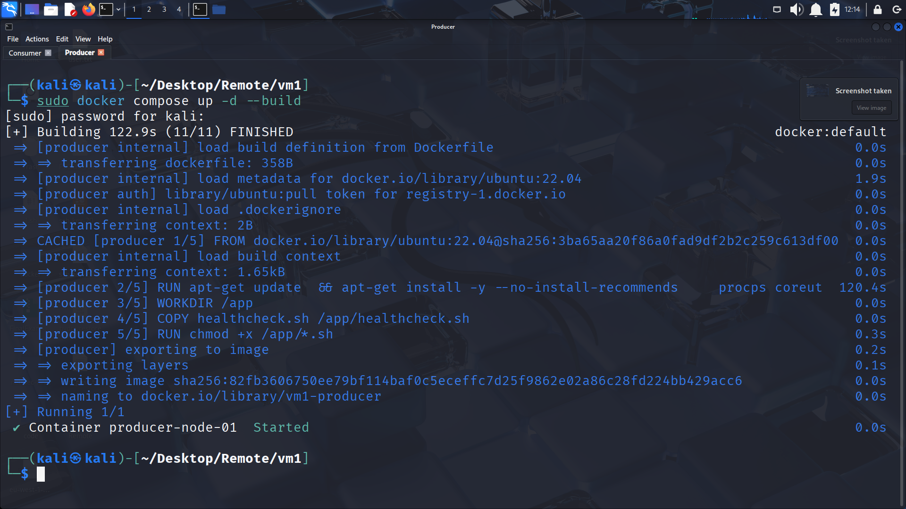
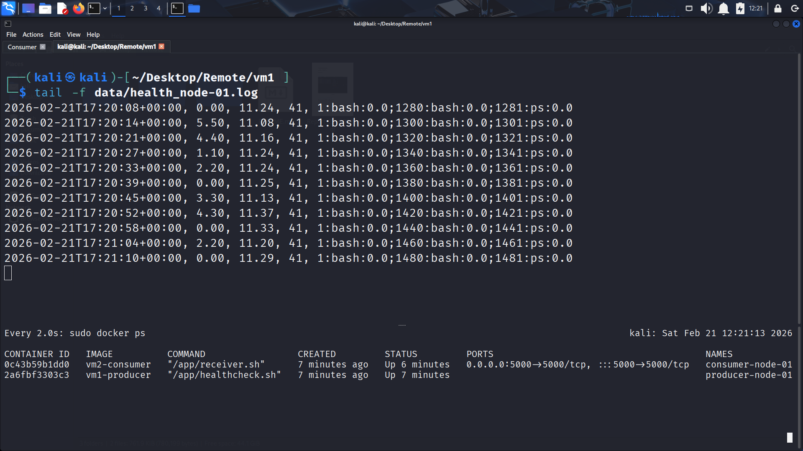
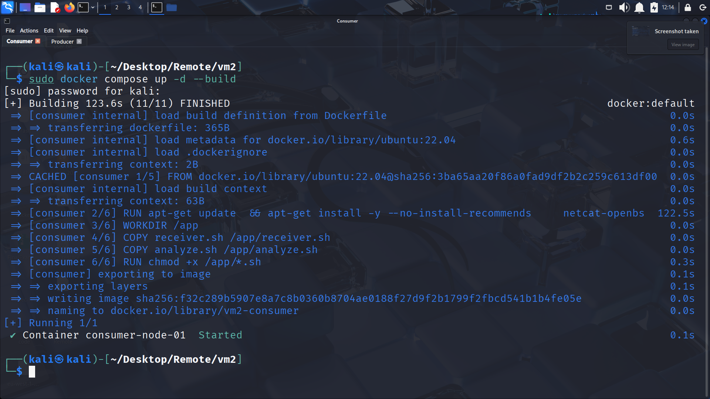
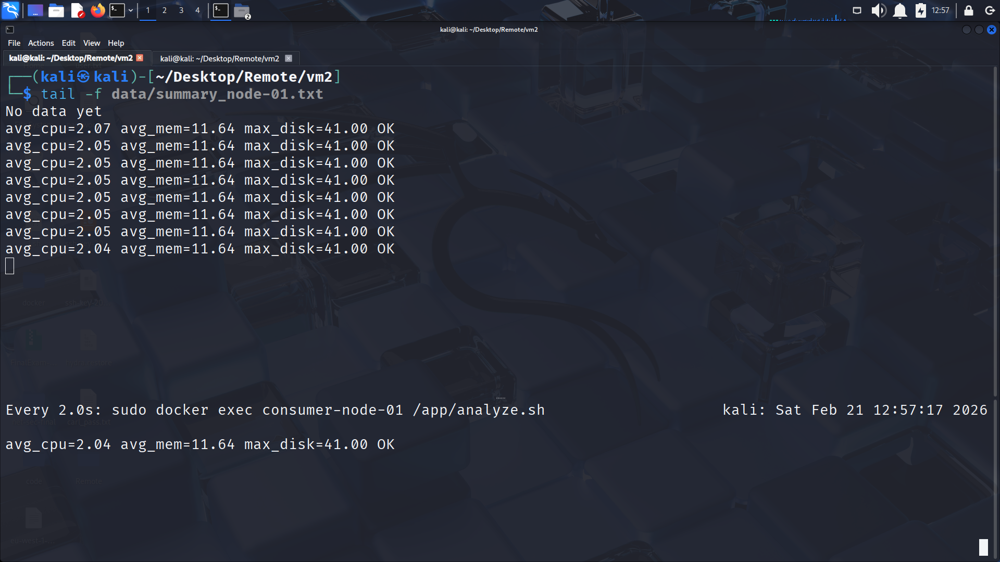

# 🛡️ Edge Health Monitor

**Lightweight, zero-dependency system health monitoring for air-gapped and edge environments.**

A containerized producer–consumer pipeline that collects real-time system metrics (CPU, memory, disk, top processes), streams them over raw TCP, and performs threshold-based alerting — all using native Linux utilities. No cloud agents, no external dependencies, no outbound internet required.

---

## Why This Exists

Enterprise monitoring stacks like **Datadog**, **Prometheus**, or **New Relic** are powerful — but they assume internet connectivity, open egress, and agent installation privileges. In many real-world environments, these assumptions don't hold:

| Environment | Constraint |
|---|---|
| 🏭 **Industrial / OT Networks** | Air-gapped, no internet, strict change control |
| 🛰️ **Edge / IoT Deployments** | Limited bandwidth, intermittent connectivity |
| 🔒 **Classified / Secure Enclaves** | No third-party agents allowed |
| 🧪 **Embedded / Minimal Systems** | No package managers, minimal disk/RAM |
| 🏗️ **Temporary Infrastructure** | Short-lived VMs, test rigs, staging environments |

**Edge Health Monitor** was built to fill this gap: a self-contained, auditable, infrastructure-as-code monitoring solution that runs entirely within your perimeter.

---

## 📌 Table of Contents

- [Architecture](#architecture)
- [Features](#features)
- [Tech Stack](#tech-stack)
- [Project Structure](#project-structure)
- [Getting Started](#getting-started)
- [Configuration](#configuration)
- [Screenshots](#screenshots)
- [How It Works](#how-it-works)
- [Use Cases](#use-cases)
- [License](#license)

---

## Architecture

```
┌──────────────────────────┐         TCP/5000          ┌──────────────────────────┐
│   Producer Node (VM1)    │ ──────────────────────►   │   Consumer Node (VM2)    │
│                          │                           │                          │
│  ┌────────────────────┐  │                           │  ┌────────────────────┐  │
│  │   healthcheck.sh   │  │     CSV metrics stream    │  │   receiver.sh      │  │
│  │                    │  │  ────────────────────►    │  │                    │  │
│  │  • CPU %           │  │                           │  │  • Listens on :5000│  │
│  │  • Memory %        │  │                           │  │  • Appends to log  │  │
│  │  • Disk %          │  │                           │  └────────┬───────────┘  │
│  │  • Top 3 processes │  │                           │           │              │
│  └────────────────────┘  │                           │  ┌────────▼───────────┐  │
│                          │                           │  │   analyze.sh       │  │
│  Docker Container        │                           │  │                    │  │
│  (producer-node-01)      │                           │  │  • Avg CPU / Mem   │  │
│                          │                           │  │  • Max Disk usage  │  │
└──────────────────────────┘                           │  │  • Alert if > 40%  │  │
                                                       │  └────────────────────┘  │
                                                       │                          │
                                                       │  Docker Container        │
                                                       │  (consumer-node-01)      │
                                                       └──────────────────────────┘
```

**Key design decisions:**
- **No service discovery** — producer pushes directly to a known IP (suitable for static, air-gapped topologies)
- **No external libraries** — everything runs on `coreutils`, `procps`, `awk`, and `netcat`
- **No cloud dependencies** — data never leaves your network

---

## Features

| Feature | Description |
|---|---|
| **Real-Time Metrics** | CPU, memory, and disk usage sampled every 5 seconds |
| **Process Forensics** | Captures the top 3 CPU-consuming processes (PID, name, CPU%) per sample |
| **Raw TCP Streaming** | Metrics streamed via `netcat` — no HTTP stack, no TLS overhead |
| **Threshold Alerting** | Flags `ALERT` when CPU or memory exceeds configurable threshold (default 40%) |
| **Persistent Logging** | All metrics and summaries persisted to Docker volumes for offline review |
| **One-Command Deploy** | `docker compose up -d --build` on each node — nothing else to install |
| **Cron-Ready Analysis** | Schedule periodic summaries with a single `crontab` entry |
| **Fully Auditable** | ~130 lines of Bash total — easily reviewed for security compliance |

---

## Tech Stack

| Layer | Technology |
|---|---|
| **Base OS** | Ubuntu 22.04 (Docker image) |
| **Scripting** | Bash (POSIX-compliant) |
| **Containerization** | Docker & Docker Compose |
| **Networking** | `netcat` (raw TCP sockets) |
| **Monitoring** | `top`, `ps`, `free`, `df`, `awk` |
| **Scheduling** | `cron` |

**Total image size:** ~75 MB per node (Ubuntu minimal + coreutils)

---

## Project Structure

```
.
├── vm1/                        # Producer node
│   ├── Dockerfile              # Ubuntu 22.04 + monitoring tools
│   ├── compose.yml             # Docker Compose service definition
│   └── healthcheck.sh          # Metric collection & TCP streaming
│
├── vm2/                        # Consumer node
│   ├── Dockerfile              # Ubuntu 22.04 + analysis tools
│   ├── compose.yml             # Docker Compose service definition
│   ├── receiver.sh             # TCP listener — logs incoming metrics
│   └── analyze.sh              # Computes averages, detects anomalies
│
├── screenshots/                # Execution evidence & demo output
│   ├── 1_health.png
│   ├── 2_summary.png
│   ├── Consumer.png
│   └── Producer.png
│
└── README.md
```

---

## Getting Started

### Prerequisites

- [Docker](https://docs.docker.com/get-docker/) (v20.10+)
- [Docker Compose](https://docs.docker.com/compose/install/) (v2.0+)
- Two machines (physical, VMs, or containers) on the same network segment

### 1. Deploy the Consumer Node

```bash
cd vm2
docker compose up -d --build
```

The consumer starts listening on TCP port **5000**, ready to ingest metrics.

### 2. Deploy the Producer Node

> **⚙️ Configure the target IP first:** Edit `vm1/healthcheck.sh` and set `HOST` to the consumer node's IP address.

```bash
cd vm1
docker compose up -d --build
```

The producer begins collecting and streaming metrics immediately.

### 3. Verify the Pipeline

```bash
# Watch producer output in real time
docker logs -f producer-node-01

# Confirm data is arriving at the consumer
docker exec consumer-node-01 cat /data/received_node-01.log

# Run analysis
docker exec consumer-node-01 /app/analyze.sh
```

### 4. Schedule Periodic Analysis (Optional)

```bash
crontab -e
# Add:
*/5 * * * * docker exec consumer-node-01 /app/analyze.sh >> /var/log/edge-health-summary.log 2>&1
```

---

## Configuration

All configuration lives in the scripts — no config files or environment variables to manage.

| Parameter | File | Default | Description |
|---|---|---|---|
| `HOST` | `vm1/healthcheck.sh` | `192.168.31.134` | Consumer node IP address |
| `PORT` | `vm1/healthcheck.sh` | `5000` | TCP port for metric streaming |
| `LISTEN_PORT` | `vm2/compose.yml` | `5000` | Exposed port on the consumer |
| `sleep` interval | `vm1/healthcheck.sh` | `5s` | Metric sampling frequency |
| Alert threshold | `vm2/analyze.sh` | `40%` | CPU / Memory alert trigger |
| `NODE_ID` | All scripts | `node-01` | Node identifier for log file naming |

> **Scaling to multiple nodes?** Deploy additional producer instances with unique `NODE_ID` values, all pointing to the same consumer.

---

## Screenshots

### Producer Node — Live Metric Collection


### Producer — Health Log Output


### Consumer Node — Data Ingestion


### Analysis — Summary & Alerting


---

## How It Works

### 1. Collection (Producer)
`healthcheck.sh` runs in an infinite loop inside the producer container:
- **CPU:** Parsed from `top -bn1` (100 − idle%)
- **Memory:** Computed via `free -m` (used / total × 100)
- **Disk:** Root filesystem usage from `df -P /`
- **Processes:** Top 3 CPU consumers from `ps -eo pid,comm,pcpu`

Each sample is formatted as a CSV line and both logged locally and pushed over TCP.

### 2. Ingestion (Consumer)
`receiver.sh` binds to a TCP port using `netcat` in listen mode. Every incoming line is appended to a persistent log file on the Docker volume — no parsing, no processing overhead at ingestion time.

### 3. Analysis (Consumer)
`analyze.sh` processes the accumulated log with `awk`:
- Computes **average CPU** and **average memory** across all samples
- Tracks **peak disk usage**
- Emits **ALERT** if any sample exceeds the configured threshold

This can run on-demand or on a `cron` schedule.

---

## Use Cases

- **Factory floor monitoring** — Track machine health without exposing OT networks to the internet
- **Remote site telemetry** — Collect metrics from edge nodes with intermittent connectivity
- **Secure environment auditing** — Fully auditable Bash scripts, no binary agents to vet
- **Temporary infrastructure** — Spin up monitoring in minutes for test labs, staging, or demos
- **Embedded systems** — Runs on any Linux system with Bash and Docker — no runtime dependencies

---

## License

This project is open-source and available under the [MIT License](LICENSE).

---

<p align="center">
  Built with 🐧 Linux, 🐳 Docker, and pure Bash — no agents, no cloud, no compromises.
</p>
